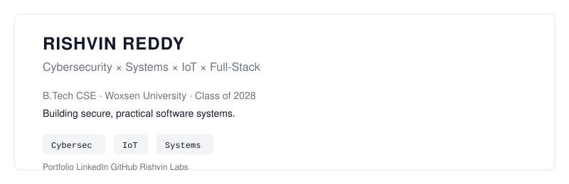
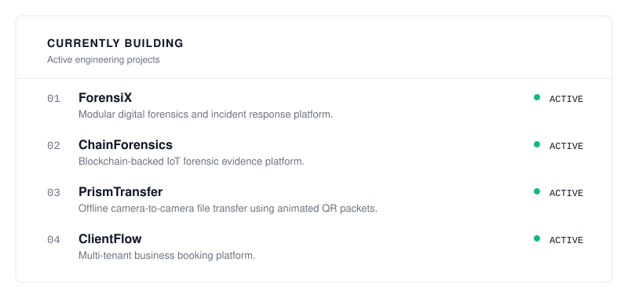
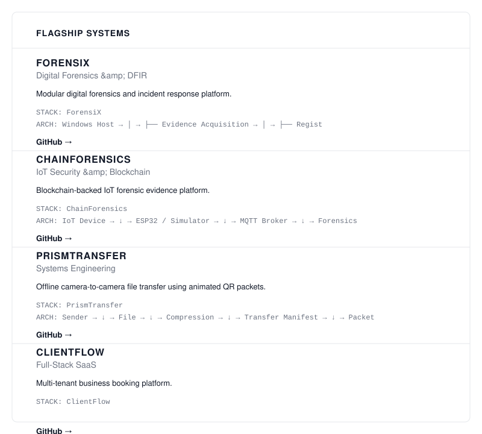
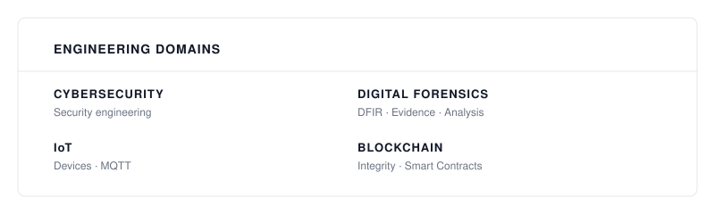
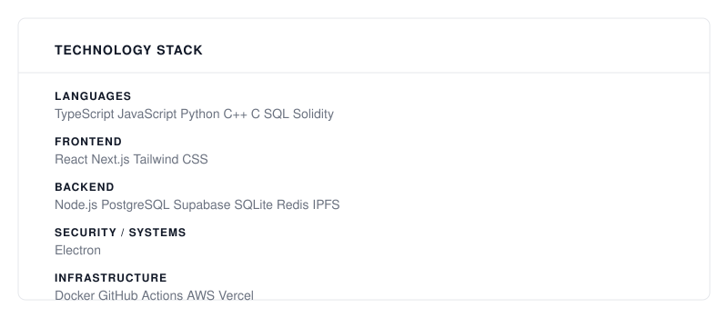
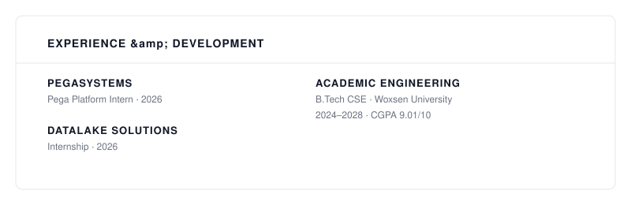
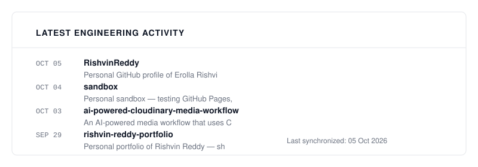
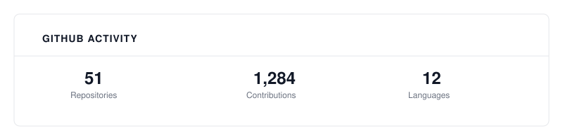
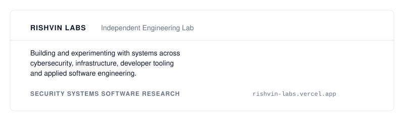
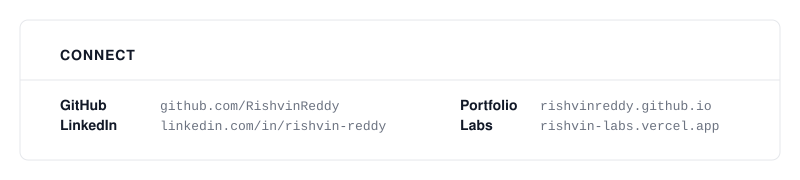

<picture>
  <source media="(prefers-color-scheme: dark)" srcset="./dark_mode.svg">
  <source media="(prefers-color-scheme: light)" srcset="./light_mode.svg">
  
</picture>

 

<picture>
  <source media="(prefers-color-scheme: dark)" srcset="assets/profile/hero-dark.svg">
  <source media="(prefers-color-scheme: light)" srcset="assets/profile/hero-light.svg">
  
</picture>

 

<picture>
  <source media="(prefers-color-scheme: dark)" srcset="assets/profile/currently-building-dark.svg">
  <source media="(prefers-color-scheme: light)" srcset="assets/profile/currently-building-light.svg">
  
</picture>

 

<picture>
  <source media="(prefers-color-scheme: dark)" srcset="assets/profile/flagship-systems-dark.svg">
  <source media="(prefers-color-scheme: light)" srcset="assets/profile/flagship-systems-light.svg">
  
</picture>

 

<picture>
  <source media="(prefers-color-scheme: dark)" srcset="assets/profile/domains-dark.svg">
  <source media="(prefers-color-scheme: light)" srcset="assets/profile/domains-light.svg">
  
</picture>

 

<picture>
  <source media="(prefers-color-scheme: dark)" srcset="assets/profile/tech-stack-dark.svg">
  <source media="(prefers-color-scheme: light)" srcset="assets/profile/tech-stack-light.svg">
  
</picture>

 

<picture>
  <source media="(prefers-color-scheme: dark)" srcset="assets/profile/experience-dark.svg">
  <source media="(prefers-color-scheme: light)" srcset="assets/profile/experience-light.svg">
  
</picture>

 

<picture>
  <source media="(prefers-color-scheme: dark)" srcset="assets/profile/activity-dark.svg">
  <source media="(prefers-color-scheme: light)" srcset="assets/profile/activity-light.svg">
  
</picture>

 

<picture>
  <source media="(prefers-color-scheme: dark)" srcset="assets/profile/activity-stats-dark.svg">
  <source media="(prefers-color-scheme: light)" srcset="assets/profile/activity-stats-light.svg">
  
</picture>

 

<picture>
  <source media="(prefers-color-scheme: dark)" srcset="assets/profile/rishvin-labs-dark.svg">
  <source media="(prefers-color-scheme: light)" srcset="assets/profile/rishvin-labs-light.svg">
  
</picture>

 

<picture>
  <source media="(prefers-color-scheme: dark)" srcset="assets/profile/connect-dark.svg">
  <source media="(prefers-color-scheme: light)" srcset="assets/profile/connect-light.svg">
  
</picture>

